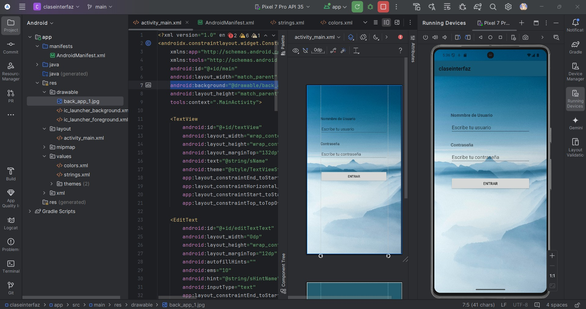
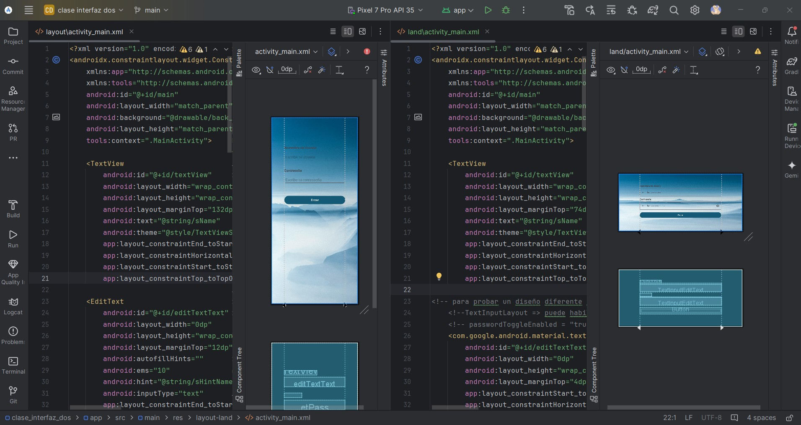
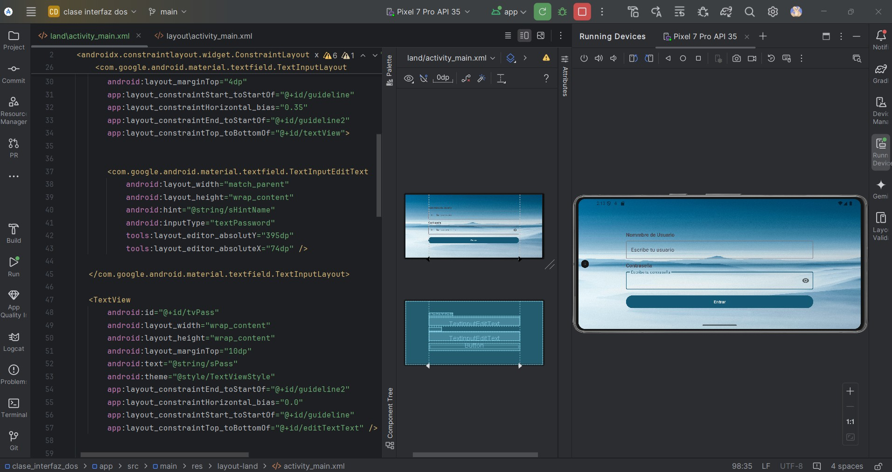
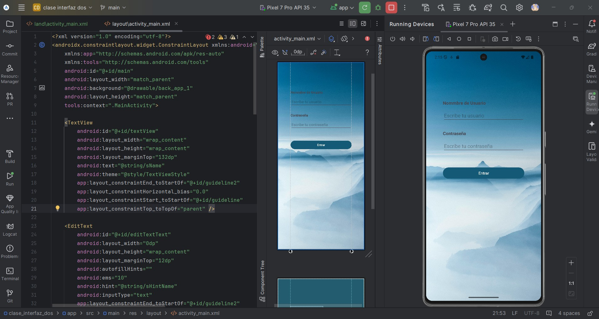

**_<h1 align="center">:vulcan_salute: Ejercicio Clase Interfaz Gráfica Parte 2 :computer:</h1>_**

Proyecto continuación del anterior, se crea archivo land\activity_main.xml para vista horizontal

Para diferenciar y aplicar otro codigo, en esta vista se utilizó TextInpuLayout
Esta imagen corresponde a ambas pantallas:

Al ejecutar el código este es el resultado obtenido:

